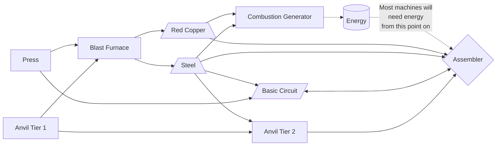
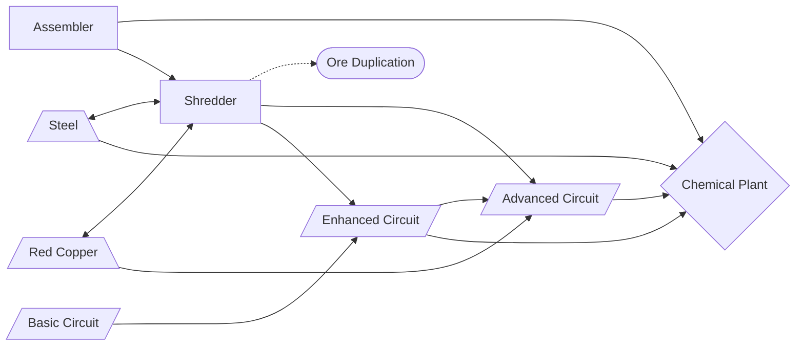
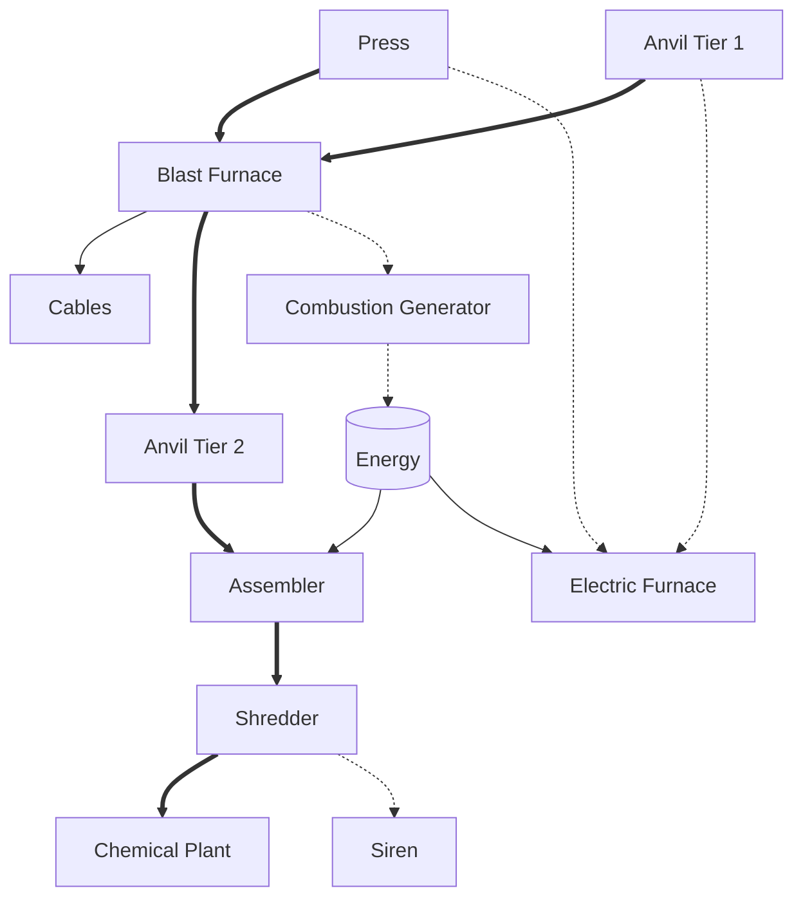

## NTM Progression

If the lines are too complicated for you, just read the **rectangular** boxes from left to right. They're in order.

### Progression Part 1: Assembler

Status: Implemented

### Progression Part 2: Chemical Plant

Note: Assembler omitted sometimes

Status: Implemented

### General Machine Progression

Consecutive machines take previous ones as implied dependencies.

